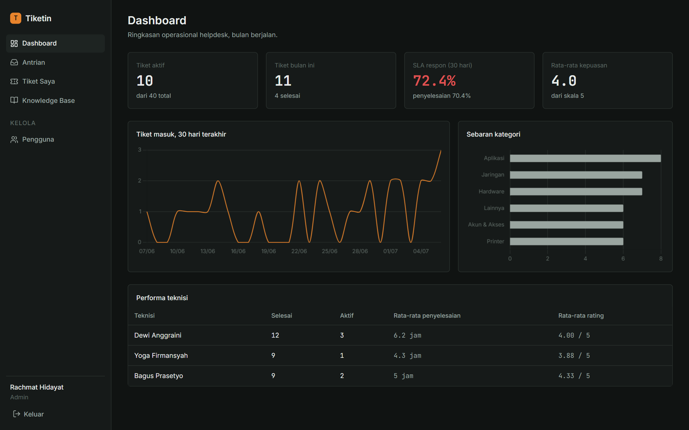
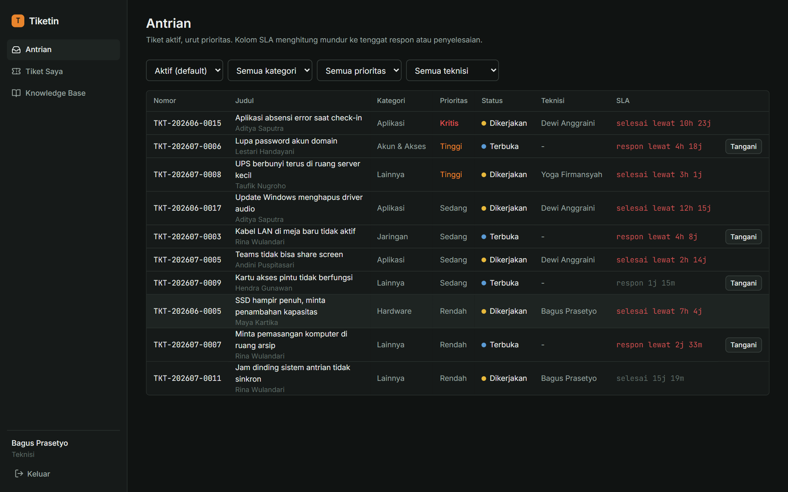
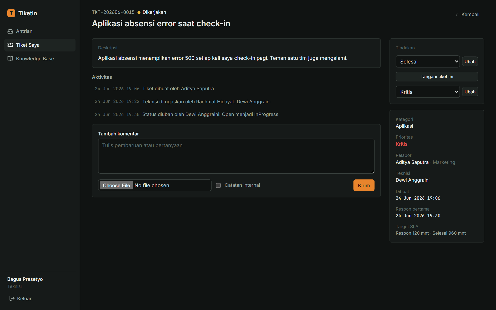
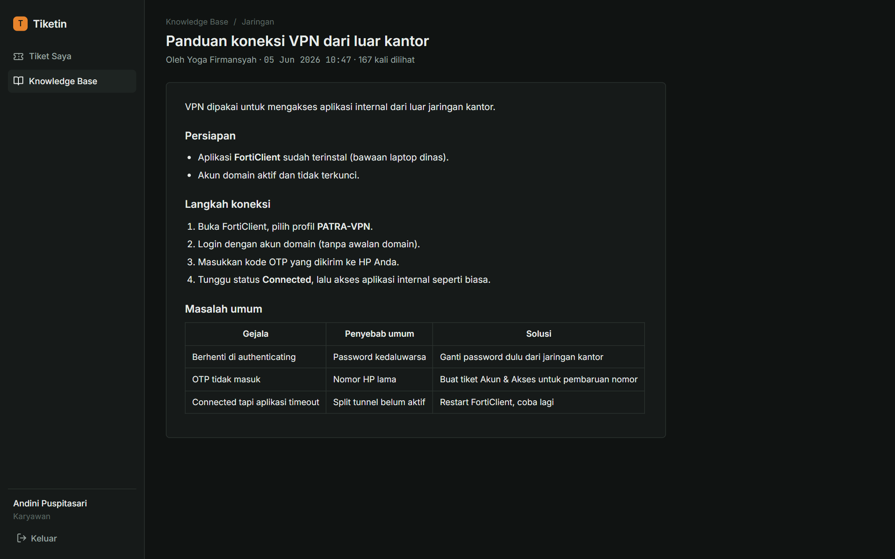
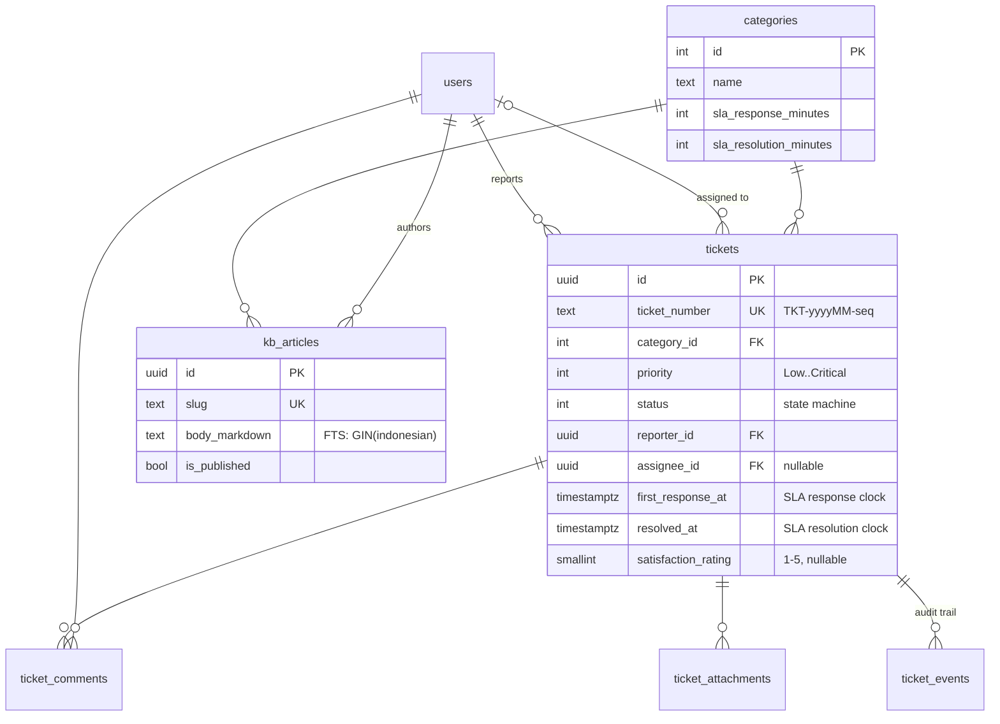

# Tiketin

Internal IT helpdesk ticketing system — employees report IT issues, technicians work a
priority queue with live SLA countdowns, and admins get operational reports. Built as a
single ASP.NET Core 8 application that serves both a Razor Pages UI (Bahasa Indonesia)
and a versioned REST API backed by the same service layer.

<!-- After pushing to GitHub, replace USER below to activate the CI badge:
[](https://github.com/USER/tiketin/actions)
-->

| | |
| --- | --- |
|  |  |
| Admin dashboard — SLA attainment, 30-day trend, technician performance | Technician queue — priority order, live SLA countdown |
|  |  |
| Ticket detail — audit timeline, staff actions, SLA targets | Knowledge base — Markdown articles, Postgres full-text search |

## Features

- **Ticket lifecycle** with an enforced state machine
  (`Open → InProgress → Resolved → Closed`, reporter-initiated `Reopened`), monthly
  sequential ticket numbers (`TKT-202607-0001`), file attachments, internal staff notes,
  and a full audit timeline per ticket.
- **SLA tracking computed on read** — response and resolution deadlines derive from the
  category's targets; the queue shows a per-second countdown that escalates from quiet
  to warning to breach. No stored SLA state to drift or invalidate.
- **Role-based access** (Employee / Technician / Admin) enforced in the service layer,
  not just the UI: employees only ever see their own tickets, technicians can't assign
  tickets to others, only admins manage users.
- **Knowledge base** with Indonesian-dictionary full-text search (Postgres `tsvector` +
  GIN index), Markdown rendering (raw HTML disabled), drafts, and view counters.
- **Admin reporting** — status/category totals, 30-day SLA attainment, technician
  performance, and a daily ticket trend chart (self-hosted Chart.js).
- **Email notifications** on assignment and resolution (MailKit → Mailpit in dev),
  designed to degrade gracefully: a failed send logs a warning, never fails the action.
- **Background job** auto-closes tickets resolved more than 7 days ago; a 5-point
  satisfaction rating gates on Resolved/Closed and feeds the reports.
- **Dual auth**: Identity cookies for the web UI, JWT bearer (with refresh tokens) for
  `/api/v1/*` — selected per request by a policy scheme, same user store.

## Architecture

One web project, layered by folder. Razor Pages and API controllers are thin: both call
the same `Services/` classes, which own every business rule (authorization scoping,
state transitions, SLA math). No page or controller touches `DbContext` directly.

```
src/Tiketin.Web
├── Domain/          entities + enums, no framework dependencies
├── Data/            DbContext, snake_case mapping, migrations, seeders
├── Services/        business logic (tickets, SLA, KB, reports, notifications)
├── Contracts/       request/response records shared by API and pages
├── Controllers/Api/ REST API v1 (JWT)
├── Pages/           Razor Pages UI (cookie auth, Bahasa Indonesia)
├── Infrastructure/  cross-cutting: auth schemes, storage, email, markdown
└── BackgroundJobs/  auto-close worker
```



Decisions worth calling out:

- **Ticket numbers** use one Postgres sequence per month, created on demand inside the
  insert transaction — atomic under concurrency, no counter-row locking, resets monthly
  by construction.
- **SLA on read**: given `created_at`, `first_response_at`, `resolved_at`, and the
  category targets, SLA state is pure arithmetic. The queue, the ticket page, and the
  30-day report all call the same `SlaService.Compute`, so they can never disagree.
- **Concurrency**: tickets carry a `xmin`-based optimistic concurrency token; concurrent
  staff edits surface as a 409 instead of a silent lost update.

## Running locally

Prereqs: .NET 8 SDK, Docker (for PostgreSQL 16 + Mailpit).

```bash
docker compose up -d          # postgres :5432, mailpit UI :8025
dotnet run --project src/Tiketin.Web
```

First run applies migrations and seeds demo data (~40 tickets over 60 days, 8 KB
articles, 12 users). Open http://localhost:5130 and log in — password for every demo
account is `Tiketin123!`:

| Role | Account |
| --- | --- |
| Admin | `admin@tiketin.local` |
| Technician | `bagus.prasetyo@tiketin.local` (also: `dewi.anggraini`, `yoga.firmansyah`) |
| Employee | `andini.puspitasari@tiketin.local` (and 7 more) |

Sent emails land in Mailpit at http://localhost:8025.

## REST API

Versioned under `/api/v1`, JWT bearer auth, list responses wrapped as `{ data, meta }`,
errors as RFC 7807 problem details. Swagger UI at `/swagger` in development; the full
spec is exported to [docs/openapi.json](docs/openapi.json).

```
POST  /api/v1/auth/login | refresh
GET   /api/v1/tickets                       list (role-scoped, filter/search/paginate)
POST  /api/v1/tickets                       create
GET   /api/v1/tickets/{id}                  detail + comments + attachments
PATCH /api/v1/tickets/{id}/status           validated transition
PATCH /api/v1/tickets/{id}/assign           admin, or technician self-assign
PATCH /api/v1/tickets/{id}/priority         staff
POST  /api/v1/tickets/{id}/comments         public or internal note
POST  /api/v1/tickets/{id}/attachments      multipart upload
POST  /api/v1/tickets/{id}/rating           reporter, once, 1-5
POST  /api/v1/tickets/{id}/reopen           reporter, ≤7 days after resolve
GET   /api/v1/tickets/{id}/events           audit timeline
GET   /api/v1/kb/articles?search=...        full-text search
POST  /api/v1/kb/articles                   staff CRUD + publish
GET   /api/v1/reports/summary|sla|technicians|trends   admin
```

## Tests

```bash
dotnet test
```

- **Unit** — SLA computation (all clock states), the status transition table, ticket
  number formatting, KB slug generation. Pure, no I/O.
- **Integration** — the real HTTP pipeline against PostgreSQL 16 via Testcontainers:
  ticket creation writes the audit event, cross-user access returns 403, illegal
  transitions return 400 problem details. Skipped automatically when Docker isn't
  available; CI (GitHub Actions) always runs them.

## Deployment

Multi-stage `Dockerfile` (publish → non-root ASP.NET runtime image) plus
`docker-compose.prod.yml` for a single-host deployment. Production reads its secrets
(DB password, JWT signing key, bootstrap admin credentials, SMTP) from environment
variables; on first start it creates the admin account from
`Bootstrap__AdminEmail` / `Bootstrap__AdminPassword` if no admin exists.

```bash
cp .env.example .env   # fill in secrets
docker compose -f docker-compose.prod.yml up -d --build
```

## Stack

ASP.NET Core 8 · Razor Pages + REST API · EF Core 8 + Npgsql · PostgreSQL 16 ·
ASP.NET Identity (cookie + JWT) · MailKit · Markdig · Chart.js · xUnit +
Testcontainers · GitHub Actions
